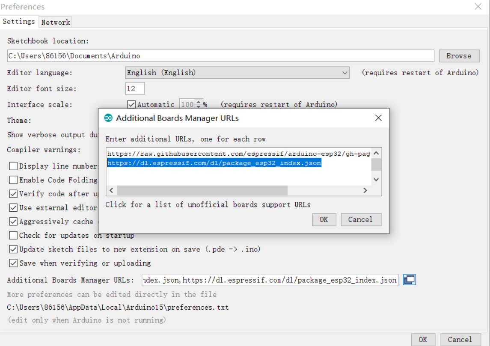
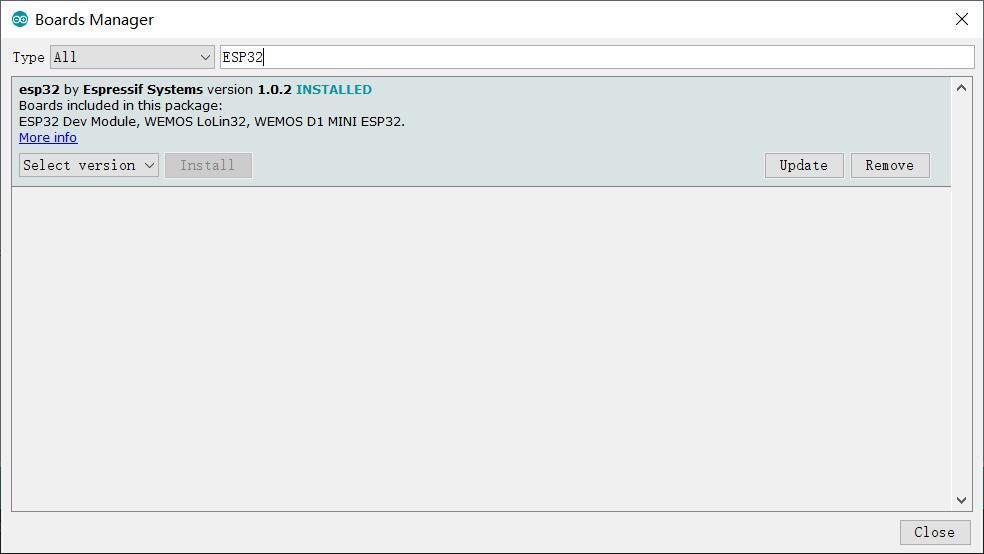
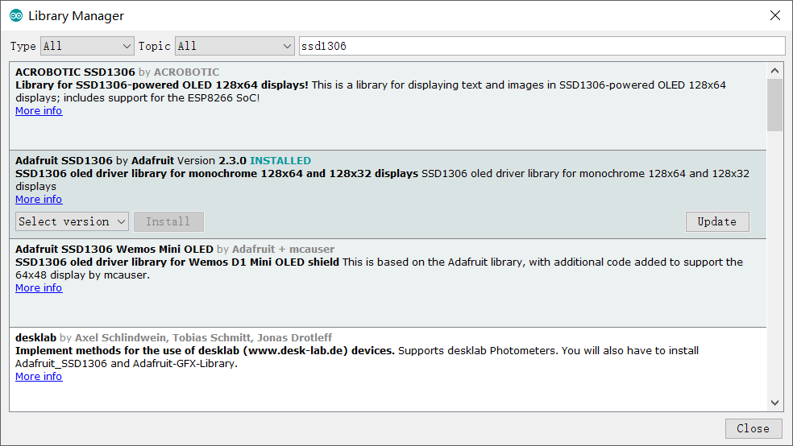
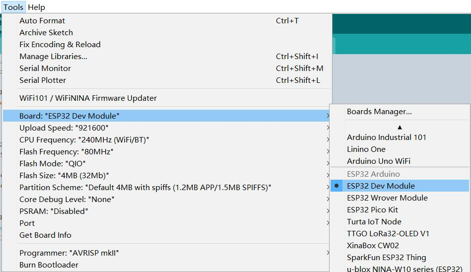

# Arduino_ESP32 Usage

```c++
/*
Version:		V1.0
Author:			Vincent
Create Date:	2020/9/12
Update Date:	2020/9/12
Note：
*/
```

[toc]

# Overview

Described how to develop ESP32 under the Arduino IDE. For MakePython and ESP32 serial.

Includes: 

- Install development board
- Install library
- Compile options

# Install Board

Arduino is supported in Espressif's products like ESP32. But need intall first.

- Open Arduino IDE

- Select "File", select "preferences".
- In the Preferences window, select "Additional Boards Manager URLs"



- Add  url : 

```c++
https://dl.espressif.com/dl/package_esp32_index.json
```

- Select "Tools", select "board", select "Boards Manager".
- Open Boards Manager as the screen snap below. 

- Search “esp32” in "Boards Manager" and install it.




# Install Library

Most popular third-party libraries can be found in the library manager.For third-party libraries that are only uploaded to Github, you can install them by installing the ZIP library.You can also simply unzip to the Arduino library folder.

## Library Manager

Arduino has its own library manager, and for some authenticated third-party libraries, it can be searched in the library manager. Click install. Common libraries such as SSD1306.

- Select "Tools", select "Manage Libraries"

- Search libraries which you need.



## Install Zip Library

Some of the libraries downloaded manually or provided with the project will come with a ZIP archive.You can add it through the capabilities of the Arduino IDE's import ZIP library.

- Select "Skecth", select "Include Library", select "Add ZIP library..."


## Unzip To Arduino Library Floder

Or you can just unzip and copy the folder to the Arduino library folder.Usually the location is "C:\Users\yourname\Documents\Arduino\libraries".


# Compile Options

Most projects provide detailed compilation options, depending on the project.

- You can choose ESP32 DEV in most cases, and the rest of the configuration takes the default.



- ESP32 WROVER has a large memory, so for projects with ESP32 Serial you can generally use this following compile options.


# Upload

Just select port and push upload...

**Make sure connect with USB cable.**