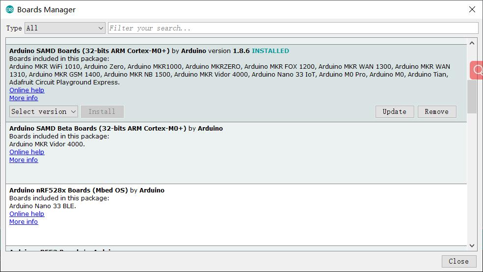
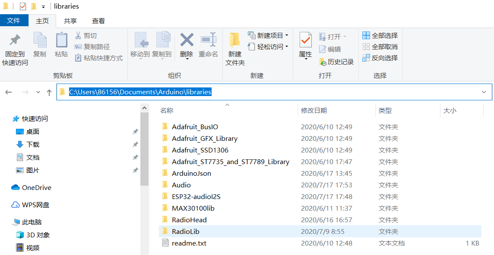
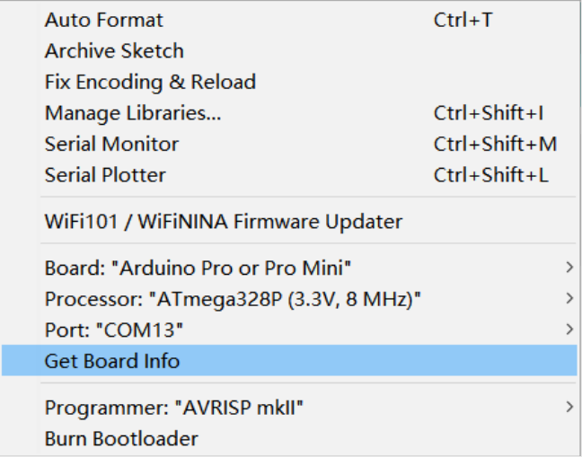

# Arduino_Maduino Usage

```c++
/*
Version:		V1.0
Author:			Vincent
Create Date:	2020/9/12
Update Date:	2020/9/12
Note：
*/
```

[toc]

# Overview

Described how to develop Marduino under the Arduino IDE. 

Includes: 

- Install development board
- Install library
- Compile options
- Connect to pc

# Install Board

There are many types of Marduino, all based on the Arduino series. For example, Pro Mini and UNO are the default support for the Arduino IDE. But Zero needs to be installed.

- Open Arduino IDE
- Select "Tools", select "board", select "Boards Manager".
- Open Boards Manager as the screen snap below. 

- Search “SAMD” in "Boards Manager" and install it.




# Install Library

Most popular third-party libraries can be found in the library manager. For third-party libraries that are only uploaded to Github,  you can install them by installing the ZIP library. You can also simply unzip to the Arduino library folder.

## Library Manager

Arduino has its own library manager, and for some authenticated third-party libraries, it can be searched in the library manager. Click install. Common libraries such as SSD1306.

- Select "Tools", select "Manage Libraries"

- Search libraries which you need.


## Install Zip Library

Some of the libraries downloaded manually or provided with the project will come with a ZIP archive. You can add it through the capabilities of the Arduino IDE's import ZIP library.

- Select "Skecth", select "Include Library", select "Add ZIP library..."


## Unzip To Arduino Library Floder

Or you can just unzip and copy the folder to the Arduino library folder. Usually the location is "C:\Users\yourname\Documents\Arduino\libraries".




# Compile Options

Most projects provide detailed compilation options, depending on the project.

- Such like LoRa Relay(Arduino Pro Mini 3.3V)



- Such like Marduino Zero A9G(Arduino Zero)


# Connect To PC

Some models have USB ports, and some smaller sensors don't. Here's how it works.

## With Micro USB

USB integrated CP2104 or other types of serial port chips, no additional converter, directly through the USB cable to connect the serial port.It is used in the same way as the standard Arduino.


##  With UART

There is no USB socket or integrated serial port chip on some modules. But there are serial ports: VCC, GND, RX, TX, DTR.There are two ways to connect a serial port.

### Makerfabs CP2104 USB2UART

Product link : [CP2104 USB2UART](https://www.makerfabs.com/cp2104-usb-to-serial-converter.html)


This CP2104 USB to Serial Converter is super tiny, a highly-integrated USB-to-UART Bridge Controller providing a simple solution for updating and programming.

The serial port module has the same pin position as the makerfabs module with no USB port.So just plug it into the hole.


The usage of usb cable is the same after that.

### CP2102 MODULES USB TO TTL

There are many common usb serial port modules on the market, which are basically connected in a common way.

| Makerfabs | USB To TTL |
| --------- | ---------- |
| VCC       | 3.3V       |
| GND       | GND        |
| RX        | TXD        |
| TX        | RXD        |


# Upload

Just select port and push upload...

**Make sure connect with USB cable.**