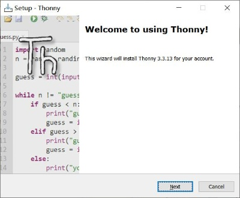
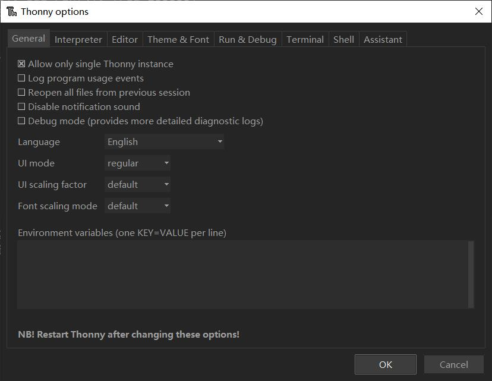
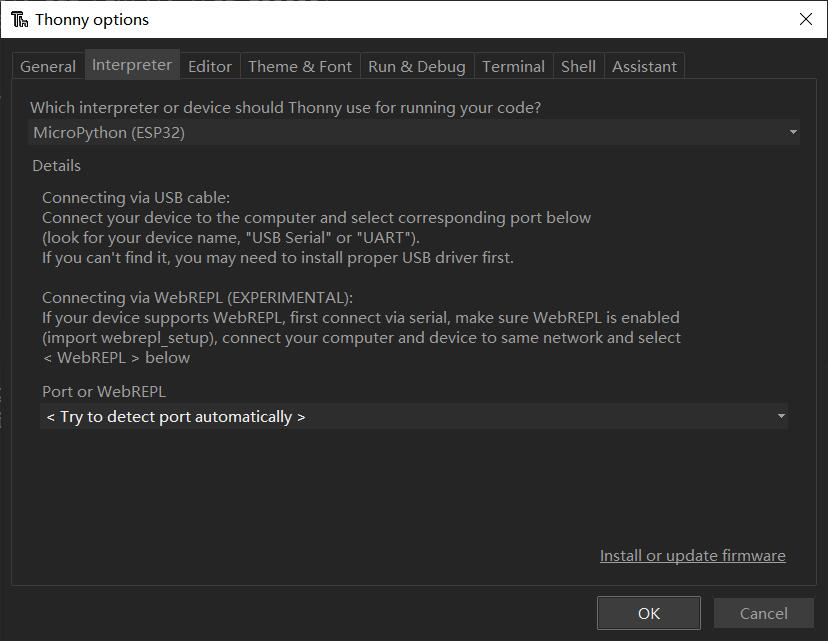
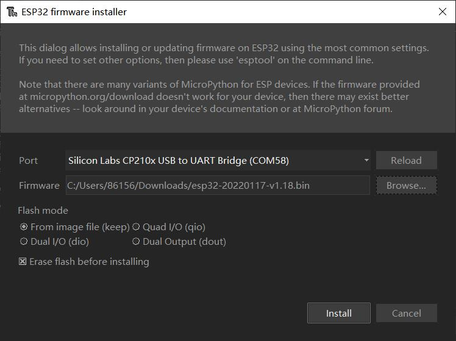
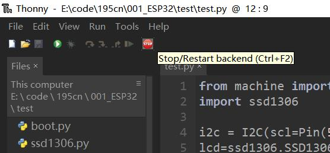
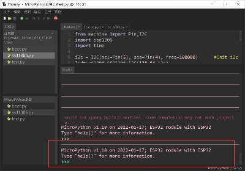
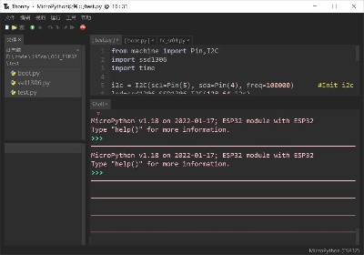
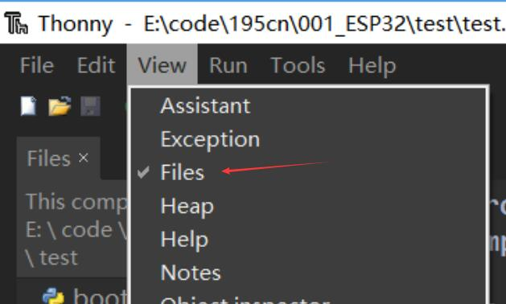
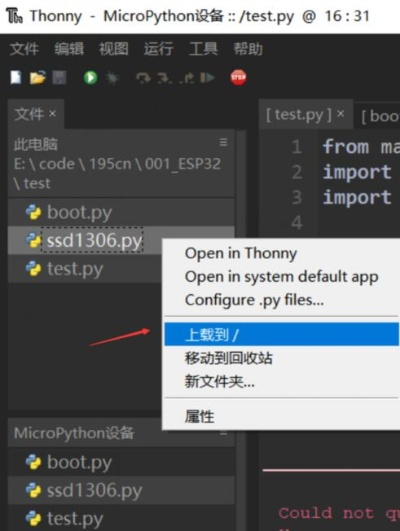
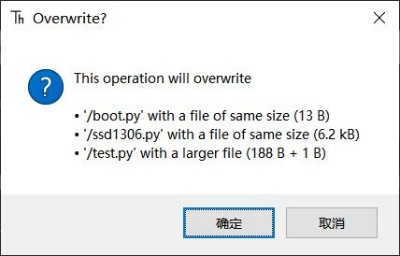

# MakePython FAQ

```c
/*
Create  :2022/4/3
Author		:Vincent
Version		:V1.0
			
*/
```


[toc]

# Thonny IDE Install and Set
## Download and Install
Download URL ：
https://thonny.org/

Select next until setup finish.




Finish.
## Language and Board set
Open Thonny.
Select “Tools”，“Options”
The Settings window pops up, and in the first tab, "General," there are language Settings.



After setting, please restart Thonny.

Select the second column interpreter and select the development board and port. Choose MicroPython(ESP32) for ESP32 and MicroPython(Raspberry Pi Pico) for Pico




To select a port, Auto is recommended.

# Usage

## Firmware Burn

Go to the previous setup development board Settings page and select "Install or Update firmware" in the lower right corner.

Download the firmware from the MicroPython website：[https://micropython.org/download/esp32/](https://micropython.org/download/esp32/)

Select the port and bin file, and select Install.



## Connect

After connecting with the USB cable, click the red STOP button.

Make sure to use a USB cable that can transfer data. Some USB cables can only be charged.



When the shell displays the MicroPython text prompt, the connection is successful.



Sometimes when you click STOP several times and still can't connect, it means that the program is stuck in a loop.

Click the part of the SHELL with the mouse to display the cursor, then press CTRL+C repeatedly to exit the program and connect.



## Software Upload

There is a file box on the left of the interface. If it is not displayed after the installation, select "View" on the toolbar and select "File".



The location of files in the file box is clickable. At present, you can only enter the folder where you put the program through this method.

Right-click the program you want to upload to ESP32 and select "Upload to /".

## Batch upload

Hold down SHIFT to select all programs in the file, right click, and select "Upload to /" to batch upload.



If there is a program before, it will prompt you whether to overwrite, select OK.



