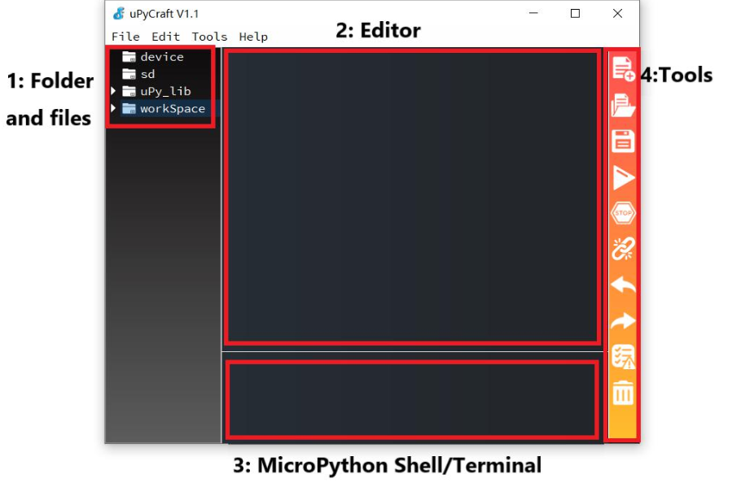
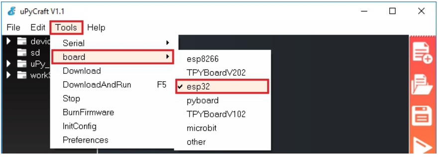
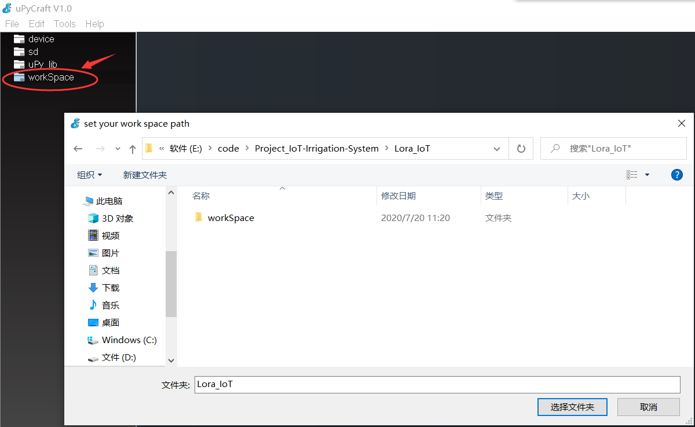
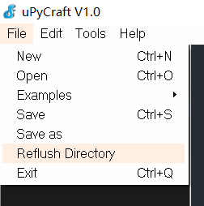
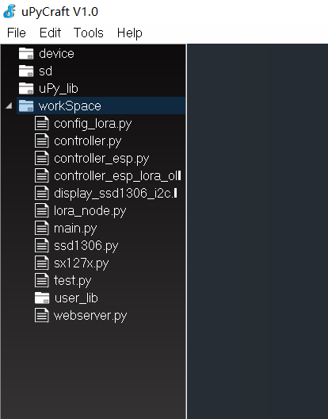
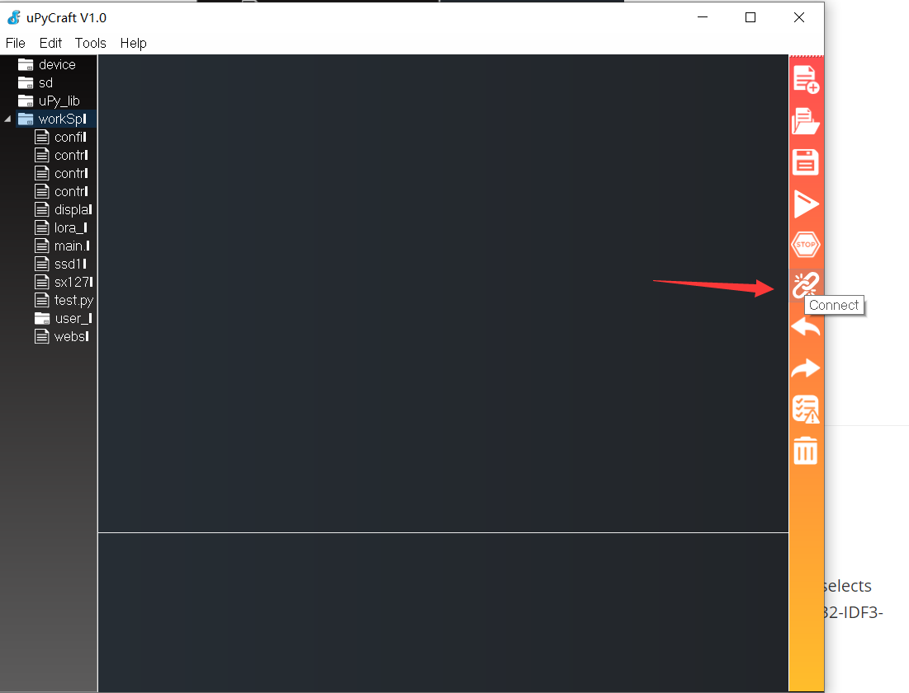
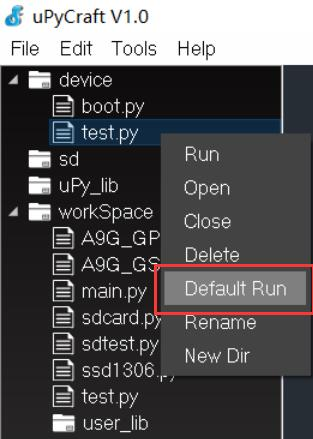

# MakePython Usage

```c++
/*
Version:		V1.0
Author:			Vincent
Create Date:	2020/9/12
Update Date:	2020/9/12
Note：
*/
```

[toc]

# Overview

Described how to develop ESP32 under the uPyCraft IDE. For MakePython and ESP32 serial.

Includes: 

- How to use uPyCraft
- Upload codes


# uPyCraft IDE 

- Click this link to download uPyCraft IDE for Windows: : [uPyCraft_win](https://randomnerdtutorials.com/uPyCraftWindows)
- Double-click to open uPyCraft. 



- Select "Tools",select "board", select "esp32" or "esp8266".It depends on the model you're using.



- Select "Tools",select "InitConfig" to reset workspace address.
- Click workSpace, and select the project folder.



- The program files must be placed in the workSpace folder of the project folder.
- Select "File", select "Reflush Directroy".




- The Python files in the folder will be displayed on the left.




# UPyCraft Upload

- Connect MakePython ESP32 to your PC, open uPyCraft, and select connect to the serial port.



- If there is no port to display, you need to download the USB driver. [CP210x driver](https://www.silabs.com/products/development-tools/software/usb-to-uart-bridge-vcp-drivers)
- Get a MicroPython fireware from [micropython.org](http://www.micropython.org/download/esp32/)
- Firmware will be prompted if it has not been burned before or for other reasons.Board selects ESP32, BURN_addr selects 0x1000, Erase_Flash selects Yes, com selects the port number. Firmware Choose Users, click Choose to Choose ESP32-IDF3-20190125-v1.10.bin.（Or other esp32 micropython bin）


- If you burn the firmware, you need to click connect again.

- Download all python programs in workSpace to ESP32.


- You can also hold down the left mouse button and drag files from the workSpace into Device.


- Press the RST button on ESP32 to reset the development board.

- Some projects do not provide main.py and need to set the main program entry manually. Right-click to select the file in Device that needs to be started up and select "Default Run".

